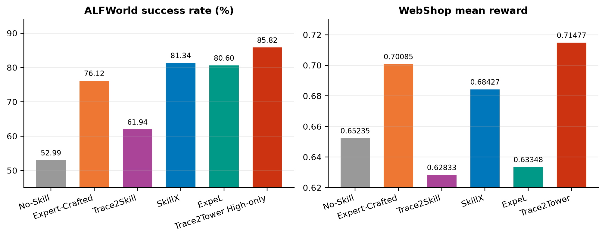
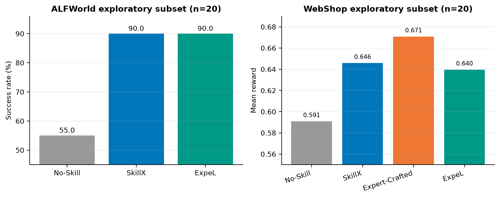
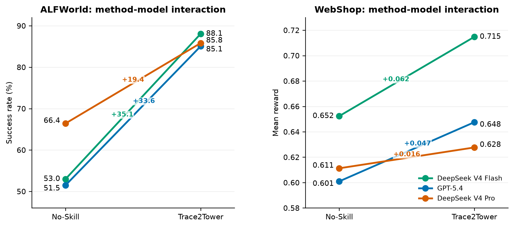
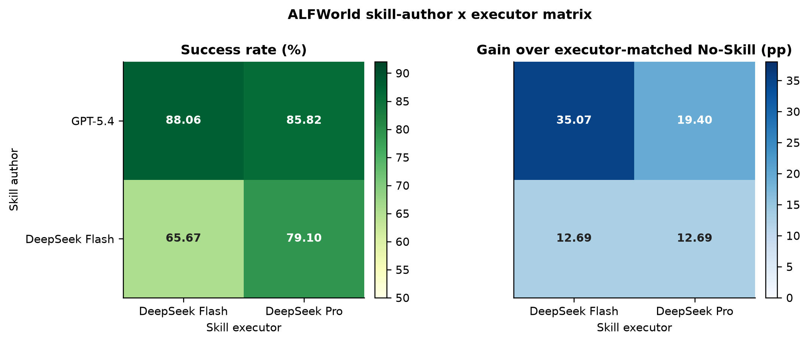
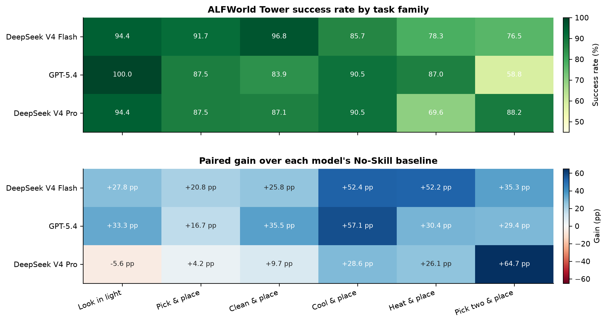
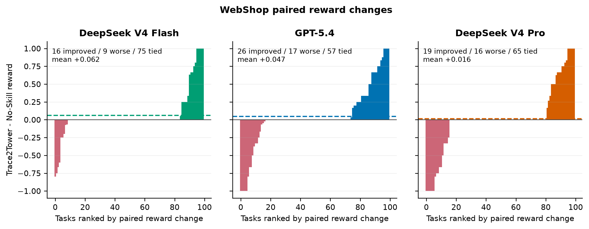
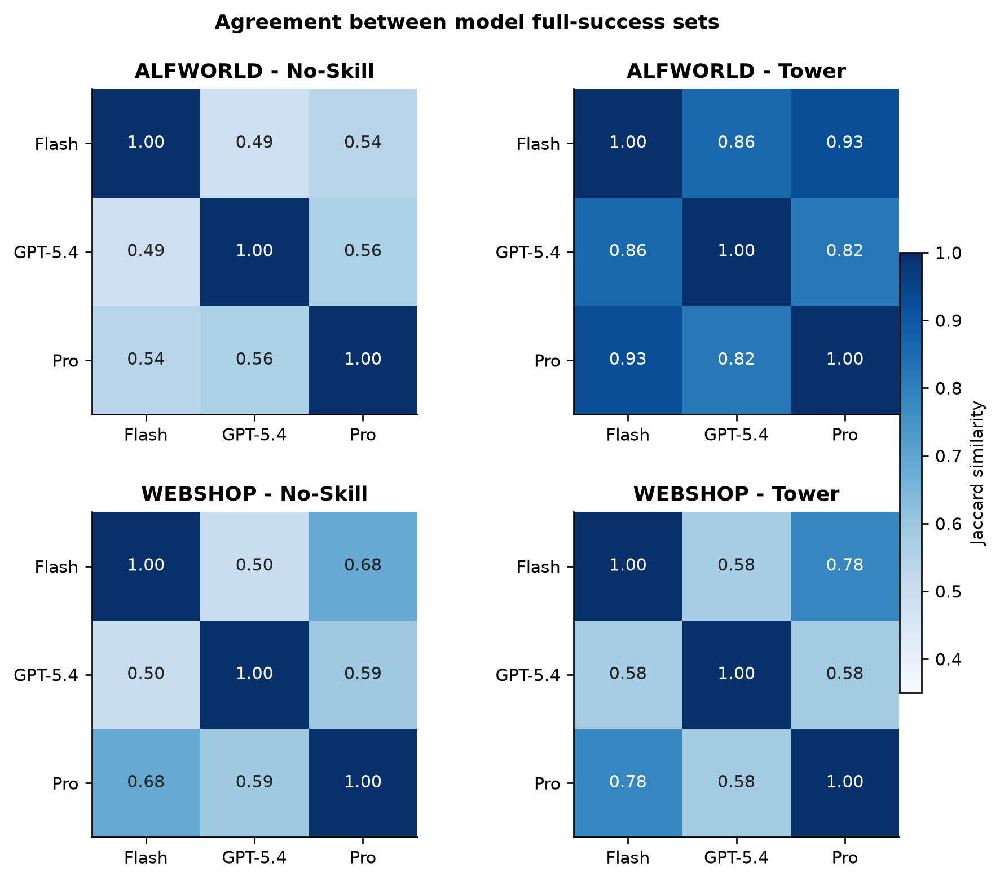

# 主实验图表说明

主报告使用七张互补图，而不是只画一张方法结果柱状图：

1. `main-performance`：两个环境的正式主结果，回答总体效果；
2. `quality-cost-tradeoff`：性能、输入 token 与步骤的联合关系，回答收益是否来自堆上下文；
3. `tower-structure`：Mid 聚类覆盖、High 路径长度和 Mid 共现热力，展示图的层次结构；
4. `tower-embedding-map`：High/Mid 向量的二维投影，展示检索空间中的层级分布；
5. `expel-mini`：保留为补充图，不作为主实验结论。
6. `alfworld-family-heatmap`：展示各方法在六类 ALFWorld 任务上的覆盖与最弱项；
7. `tower-compression-utilization`：展示轨迹证据压缩、层级产物数量和测试时目录利用率。

PNG 用于 Markdown 预览，PDF 用于论文排版。绘图数据位于 `figures/report-data.json`，脚本为
`scripts/experiments/analyze/plot_main_report.py`。

跨模型补充分析另包含五张图：

10. `cross-model-tower-gains`：展示各执行模型从 No-Skill 到 Trace2Tower 的起点、终点和增益；
11. `alfworld-author-executor-matrix`：展示 ALFWorld 技能作者与执行模型的 2×2 控制矩阵；
12. `alfworld-cross-model-family-spectrum`：展示 ALFWorld 各任务族的 Tower 成功率及相对 No-Skill 增益；
13. `webshop-paired-reward-waterfalls`：展示 WebShop 每个任务的配对 reward 变化分布；
14. `cross-model-success-set-agreement`：展示模型之间满分任务集合的 Jaccard 一致性。

跨模型图的聚合数据位于 `figures/cross-model-analysis-data.json`，生成脚本为
`scripts/experiments/analyze/plot_cross_model_analysis.py`，详细解读见
`CROSS_MODEL_PAIRED_ANALYSIS.md`。

## 正式主结果

## 性能与成本

## Tower 结构

## 任务族泛化

## ExpeL 补充图

## 跨模型补充分析

