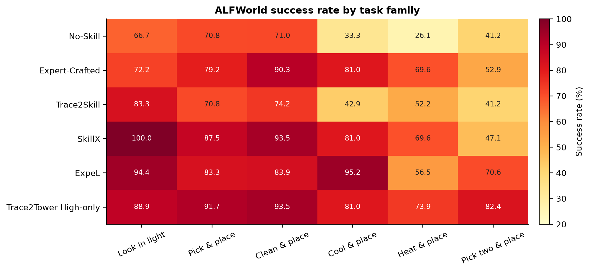
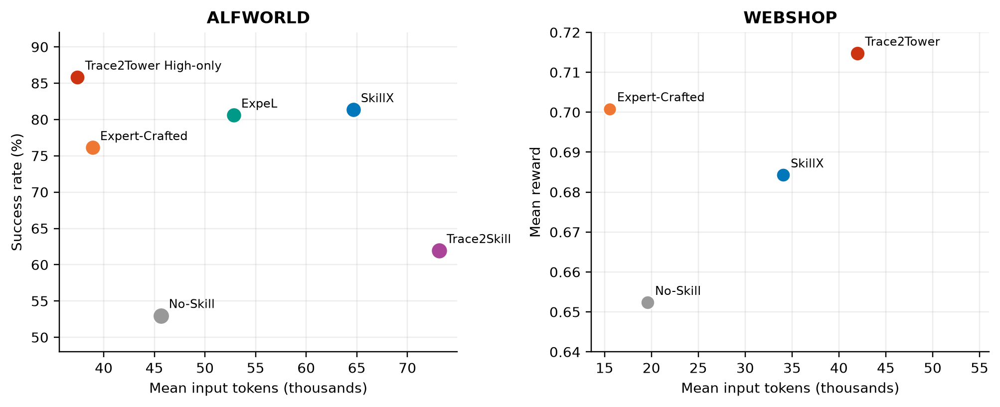
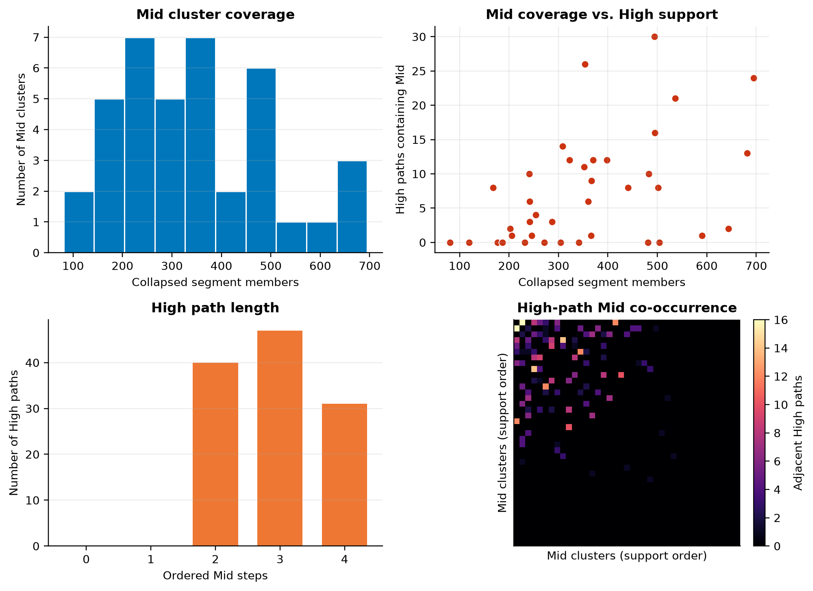
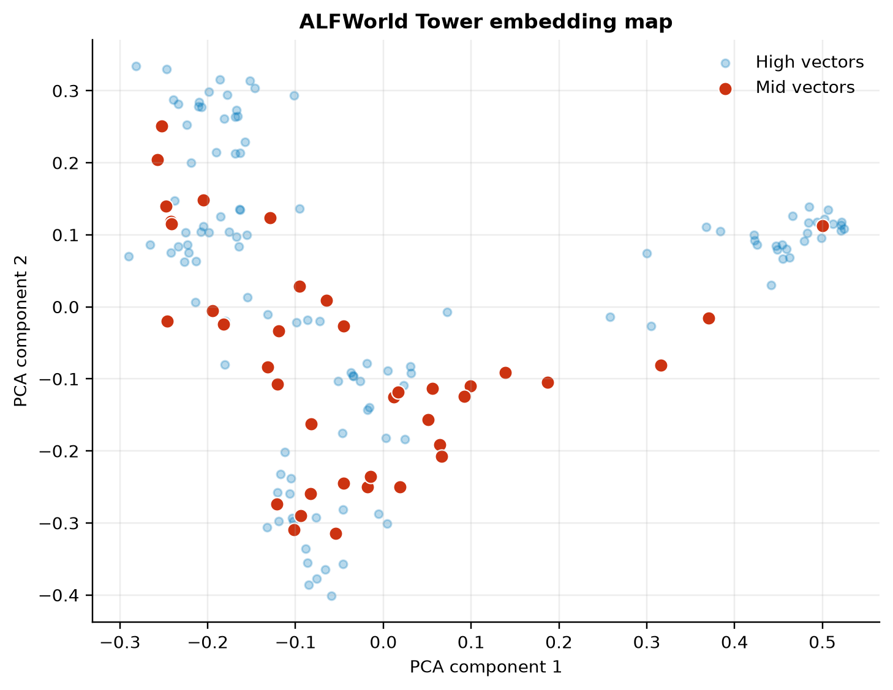
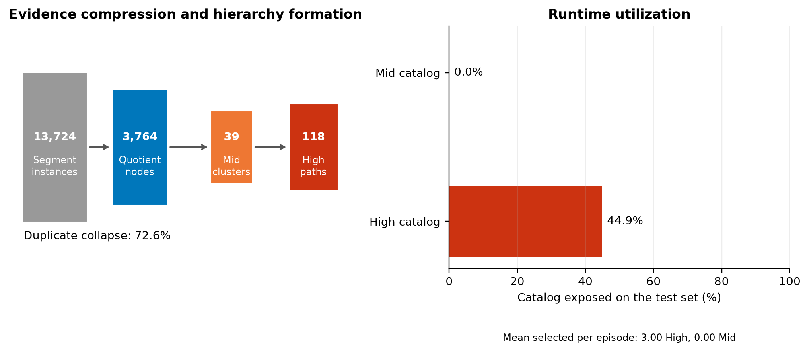

# Trace2Tower 主实验报告

## 摘要

Trace2Tower 定位为一个**动态长程任务治理（Dynamic Long-Horizon Task Governance）**框架。它从成功、部分成功和失败轨迹中抽取领域事件，以**语义关系、时序转移、结果一致性和成败对比**构建 EigenTrace 图，自动发现 Mid 技能与 High 执行路径，并在运行时按任务与阶段选择性暴露经验。

这里的“治理”不是生成更多技能文本，而是统一管理经验的归纳、分层、选择与暴露：High 负责长程任务结构，Mid 记录阶段前置条件与局部执行证据，动态检索让当前任务只接收相关经验。

本文回答三个问题：

1. 层次事件图能否治理长程任务中的阶段依赖、前置条件和失败恢复？
2. 动态经验暴露相较静态技能或扁平记忆是否更适配状态变化的交互任务？
3. 同一治理框架能否迁移到任务性质不同的环境？

| 环境                    |          指标 | Trace2Tower |                     最强对照 |       差异 |
|-----------------------|------------:|------------:|-------------------------:|---------:|
| ALFWorld valid_unseen |         成功率 |  **85.82%** | SkillX no-rewrite 81.34% | +4.48 pp |
| WebShop P100          | Mean reward | **0.71477** |   Expert-Crafted 0.70085 | +0.01392 |

在 ALFWorld 上，Trace2Tower 的 High-only 主运行相较 No-Skill 提高 32.84 个百分点，并同时降低平均步骤、无效动作和输入 token。相较 Expert-Crafted Skills，成功率提高 9.70 个百分点，95% CI 为 `[+2.24,+17.16]` pp，McNemar exact `p=0.0241`。
作为公开 baseline，ExpeL 在同一 ALFWorld 测试集达到 80.60%，低于 Trace2Tower 5.22 个百分点。

单次 Full 运行达到 88.06%，保留为运行时 Mid 联合注入的 case study；后续正式重复显示 Mid 自筛选的暴露数量发生明显漂移，因此该值不作为可复现主结论或消融基准。本文以不经过 Mid 自筛选的 High-only 合同报告主表；图构建的结构产物和单次结构消融仅用于分析图如何组织证据。

在 WebShop 上，相同图构建算法和层次运行时合同取得最高 mean reward 和满分率点估计；同一 P100 预算下 ExpeL 的 mean reward 为 0.63348，低于 No-Skill、SkillX 和 Trace2Tower。Trace2Skill 的开源代码复现进一步表明，静态全局技能在 ALFWorld 上仍有正向价值，但在 WebShop 上受到动态状态与任务相关性变化的限制；这一结果用于界定动态治理的适用场景，不用于宣称普遍显著优于 Trace2Skill。

---

## 1. 实验设置

### 1.1 数据与模型

| 环境       | 构建池                                                | 评估集                           | 主指标         | 执行模型                |
|----------|----------------------------------------------------|-------------------------------|-------------|---------------------|
| ALFWorld | P310：310 个训练任务，每题 repeat 0–3，共 1,240 条 No-Skill 轨迹 | AgentBench valid_unseen 134 题 | 成功率         | `deepseek-v4-flash` |
| WebShop  | P100：100 个训练任务，每题 repeat 0–3，共 400 条 No-Skill 轨迹   | 冻结 validation 100 题           | mean reward | `deepseek-v4-flash` |

两套实验均使用 `gpt-5.4` 完成技能渲染和结构化 plan rewrite。

ALFWorld 与 WebShop 使用相同流程：

```text
领域事件抽取
→ quotient node 折叠
→ EigenTrace 图构建
→ 谱分解发现 Mid
→ 成功路径发现 High
→ High rewrite
→ Top-3 High 注入
```

环境适配仅定义领域事件语义，不按任务类别人工分桶，也不将物体类型或商品类别直接作为图社区。

主评估采用固定任务集合、`temperature=0` 和每题一次正式执行。ALFWorld 每个 `sample_id` 加载固定的 game 文件，WebShop 使用本地冻结商品与搜索数据，因此环境状态不随调用变化；远程模型 API 在 `temperature=0` 下仍可能存在非确定性。配对 bootstrap 以任务为重采样单位，仅衡量任务组成不确定性，不代表 API 重复运行方差。ALFWorld 主表使用 High-only 的完整运行；进一步重复正在以同一合同补充。

### 1.2 对照方法

* **No-Skill**：不使用外部经验。
* **Expert-Crafted Skills**：依据环境规则和领域经验人工编写的冻结技能。
* **SkillX**：从成功轨迹中归纳 Plan 与 Function。
* **Trace2Skill**：从成功与失败轨迹提出局部 patch，并层次合并为一个测试时无检索的静态技能；论文预定义的 `+Combined` 与 `+Error` 各构建一次并分别报告，不进行测试集选优。
* **Trace2Tower**：从成功、部分成功和失败轨迹中构建层次事件图。
* **ExpeL**：按公开仓库的规则归纳与 episodic memory 路径完成 P310/P100 全量复现，作为公开 baseline 纳入主表。

Expert-Crafted Skills 作为人工领域工程强基线，用于衡量自动轨迹归纳与专家规则之间的差距。

为避免人工先验、额外构建次数和开发集选择造成不对称优势，所有自动归纳方法均从无人工技能初始化的相同信息条件出发。本文比较的是各方法在统一预算下将轨迹转化为技能的能力，而非通过方法专属调优逼近各自可能达到的经验上限。

完整图表及其叙事分工见 [FIGURES.md](FIGURES.md)。ExpeL 全量复现协议与结果见
`experiments/baselines/expel/RESULTS.json`。
Trace2Skill 的开源复现协议、两个原生变体和跨环境分析见
`experiments/baselines/trace2skill/REPORT.md`。

---

# 2. ALFWorld

## 2.1 主结果

| 方法                        |        成功率 |      平均步骤 |   平均无效动作 | 平均输入 token | 平均 context 字符 |
|---------------------------|-----------:|----------:|---------:|-----------:|--------------:|
| No-Skill                  |     52.99% |     14.84 |     0.54 |     45,677 |             0 |
| Expert-Crafted Skills     |     76.12% |     11.49 |     0.37 | **38,889** |     **3,286** |
| Trace2Skill +Combined     |     58.96% |     14.11 |     0.27 |     68,449 |         9,508 |
| Trace2Skill +Error        |     61.94% |     14.14 |     0.39 |     73,131 |        11,447 |
| SkillX no-rewrite         |     81.34% |     11.69 |     0.49 |     64,651 |        13,092 |
| ExpeL                     |     80.60% |     11.57 |     0.31 |     52,831 |         7,469 |
| **Trace2Tower High-only** | **85.82%** | **10.50** | **0.22** | **37,410** |     **1,960** |

Trace2Skill 按官方静态技能合同复现，+Combined 与 +Error 相较 No-Skill 分别提高 5.97 和 8.96 个百分点。两者为并列的预定义变体，不是测试集候选。Trace2Tower High-only 相较 No-Skill 提高 32.84 个百分点，相较 SkillX 提高 4.48 个百分点，相较 ExpeL 提高 5.22 个百分点。相较 SkillX，其平均输入 token 降低 42.1%，context 字符降低 85.0%；相较 No-Skill，输入 token 降低 18.1%。

相较 Expert-Crafted Skills，Trace2Tower High-only 提高 9.70 个百分点，配对 bootstrap 95% CI 为 `[+2.24,+17.16]` pp，McNemar exact `p=0.0241`。相较 SkillX（16 胜、10 负）和 ExpeL（15 胜、8 负）的点估计为正，但单次运行的 McNemar 检验分别为 `p=0.327` 和 `p=0.210`，不作显著性优越主张。自动图归纳仍同时改善步骤、无效动作和执行成本。

### 2.1.1 任务族泛化

| 方法                        |  Macro 成功率 |   最弱任务族成功率 | 最强任务族成功率 |
|---------------------------|-----------:|-----------:|---------:|
| No-Skill                  |     51.51% |     26.09% |   70.97% |
| Expert-Crafted Skills     |     74.20% |     52.94% |   90.32% |
| Trace2Skill +Error        |     60.76% |     41.18% |   83.33% |
| SkillX                    |     79.77% |     47.06% |  100.00% |
| ExpeL                     |     80.67% |     56.52% |   95.24% |
| **Trace2Tower High-only** | **85.22%** | **73.91%** |   93.55% |

Macro 成功率对六个任务族等权，避免样本较多的 `pick_clean_then_place` 主导总体值。Trace2Tower High-only 在六个任务族上均高于 73%，说明总体增益并非来自单一任务族。



### 2.1.2 执行时上下文与 token 效率

执行时成本分为两个不同层面：平均输入 token 是 agent 在整个 episode 中实际接收的输入量；平均 context 字符是一次性注入的经验文本长度。二者不计 embedding 成本，也不将测试时 plan rewrite 的 renderer 用量混入 agent 输入量。

| 对照方法 | Trace2Tower High-only 的平均输入 token 变化 | 注入 context 字符变化 |
|---|---:|---:|
| Expert-Crafted Skills | −3.8% | −40.3% |
| Trace2Skill +Combined | −45.3% | −79.4% |
| Trace2Skill +Error | −48.8% | −82.9% |
| SkillX no-rewrite | −42.1% | −85.0% |
| ExpeL | −29.2% | −73.8% |

High-only 只保留与当前任务匹配的 Top-3 High，平均经验 context 为 1,960 字符，同时仍达到最高的 ALFWorld 成功率点估计。它相对 No-Skill 的 agent 输入 token 也降低 18.1%，说明收益并非来自堆叠更长的提示。相较人工技能，Trace2Tower 的输入 token 略低，但人工技能仍具有更短步骤的执行效率优势。



### 2.1.3 构建阶段 GPT 成本

构建成本采用与 baseline 对称的 GPT chat 口径，只统计技能归纳与渲染，不含训练轨迹采集、embedding、测试时 plan rewrite 或评估 Agent。

| 方法          | GPT 调用 |  输入 token | 输出 token |       总 token |
|-------------|-------:|----------:|---------:|--------------:|
| Trace2Tower |    157 |   983,841 |   41,891 | **1,025,732** |
| SkillX      |    150 | 1,133,696 |   99,945 |     1,233,641 |
| ExpeL       |     74 |       未保留 |      未保留 |           未保留 |

在完整记录可严格比较的 Trace2Tower 与 SkillX 之间，Trace2Tower 的输入、输出和总 chat token 分别减少 13.22%、58.09% 和 16.85%，但调用数增加 4.67%。这说明图优先聚合主要减少了总体生成量，尤其是输出量，不能表述为调用次数优势。

ExpeL 的 74 次规则更新调用有完整计数，但全量构建在复用 checkpoint 后没有保留原始 provider token usage；报告中的 0 是缺失值而非零成本，因此不进入 token 比例计算。机器可读口径见 `experiments/alfworld/official/ALFWORLD_CONSTRUCTION_COST.json`。

### 2.1.4 部署评估中的跨测试集稳定性

除 134 题 High-only 主评估外，我们在部署优化协议中固定同一 Tower `v0`，并在两个互不重叠的 120 题评估集上与 No-Skill 逐题配对。该协议采用 `plan_rewrite / budgeted_v2 / renderer`，因此作为部署评估证据单独报告，不与 High-only 主表合并。

| 部署评估集  |        No-Skill | Tower v0 / final v1 |    配对成功率差 | Tower-only / No-Skill-only 胜场 | McNemar exact p |
|--------|----------------:|--------------------:|----------:|------------------------------:|----------------:|
| Test-1 | 63.33% (76/120) |     80.00% (96/120) | +16.67 pp |                        28 / 8 |         0.00119 |
| Test-2 | 59.17% (71/120) |     80.83% (97/120) | +21.67 pp |                        32 / 6 |       0.0000243 |

两个测试集上，冻结 Tower 相对 No-Skill 的增益方向一致，幅度均超过 16 个百分点，且配对胜场显著多于负场。这支持部署运行时的跨测试集稳定性；但它不改变主表采用 High-only 合同、部署优化候选最终选择 `v0_noop` 的事实。

---

## 2.2 构建机制消融

13,724 个 segment instance 经 duplicate-embedding collapse 后形成 3,764 个 quotient node。各结构变体均从同一预处理输入重新执行图构建、聚类、High 发现、渲染和索引。





图中可以直接看到 Mid 聚类覆盖、High 路径长度以及 High 路径诱导的 Mid 共现关系；向量投影用于展示检索空间的层级分布，不作为额外调参依据。

| 结构指标                    |               数值 |
|-------------------------|-----------------:|
| Segment instances       |           13,724 |
| Quotient nodes          |            3,764 |
| Duplicate collapse rate |           72.57% |
| Mid / High              |         39 / 118 |
| Mid 规模归一化熵              |           0.9741 |
| Mid 规模变异系数              |            0.435 |
| High 平均路径长度             |            2.924 |
| High 覆盖的 Mid            |  28 / 39（71.79%） |
| 测试集实际使用 High            | 53 / 118（44.92%） |
| High-only 主运行实际使用 Mid   |       0 / 39（0%） |

高归一化熵表明证据没有坍缩到少数巨型 Mid；High-only 主运行实际暴露了超过四成 High。Mid 保留为图中的局部证据层，但不参与当前主运行的注入。



| 配置                | 保留信号                              | Mid / High |    单次运行成功率 |
|-------------------|-----------------------------------|-----------:|-----------:|
| G0 Full graph, High-only runtime | 语义 + 时序 + 结果 + signed contrastive | 39 / 118 | **85.82%** |
| G1 Semantic-Only  | 仅语义，固定 K=39                       |     39 / 0 |        不执行 |
| G2 No Transition  | 语义 + 结果 + signed contrastive      |    19 / 76 |     70.15% |
| G3 No Outcome     | 语义 + 时序 + signed contrastive      |   39 / 106 |     73.88% |
| G4 No Contrastive | 语义 + 时序 + 结果                      |    10 / 44 |     73.88% |

该表以当前 High-only 主运行作为性能锚点；G2-G4 仍是单次结构变体运行，因而不报告显著性或可复现的性能差异。它显示时序、结果和成败对比会显著改变 Mid 数量与 High 路径形态：移除时序转移后 High 从 118 降至 76；取消成败对比分解后 Mid 从 39 合并为 10。Semantic-Only 在相同 quotient node 和固定 K 下无法形成至少包含两个不同 Mid 的合规端到端 High，因此不使用 fallback 生成执行结果。88.06% 的 Full Mid 运行单独保留在运行时 case study 中，不作为本表的基准。

---

# 3. WebShop

## 3.1 P100 构建

Trace2Tower 与 SkillX 使用相同的 P100 训练任务预算。400 条 No-Skill 轨迹共产生：

* 2,780 个事件 segment；
* 729 个 quotient node；
* 8 个 Mid；
* 38 条正对比 High path。

WebShop 使用与 ALFWorld 同构的运行时合同：

1. High Top-3 检索；
2. plan rewrite；
3. 按 rewritten step 检索 Mid；
4. 筛选最多 8 个 Mid；
5. 联合注入 rewritten High 与 Mid。

事件定义覆盖查询、结果导航、候选选择、属性检查、选项绑定、价格检查、回退和购买。商品名称与具体事实不直接作为社区标签。

## 3.2 主结果

| 方法                    | Mean reward |     满分率 |     平均步骤 |   平均无效动作 | 平均输入 token |
|-----------------------|------------:|--------:|---------:|---------:|-----------:|
| No-Skill              |     0.65235 |     47% |     7.69 |     0.30 |     19,572 |
| SkillX P100           |     0.68427 |     48% |     7.95 |     0.29 |     34,044 |
| ExpeL P100            |     0.63348 |     42% |     9.86 |     0.31 |     54,092 |
| Trace2Skill +Combined |     0.59685 |     42% |    11.50 |     0.54 |     47,043 |
| Trace2Skill +Error    |     0.62833 |     44% |    11.54 |     0.74 |     42,828 |
| Expert-Crafted Skills |     0.70085 |     50% | **6.22** | **0.06** | **15,526** |
| **Trace2Tower P100**  | **0.71477** | **52%** |     9.90 |     0.16 |     41,977 |

Trace2Tower 相较 No-Skill 提高 `0.06242` mean reward，95% CI 为 `[+0.00500,+0.12450]`；相较 SkillX 提高 `0.03050`，相较 ExpeL 提高 `0.08129`。

相较 Expert-Crafted Skills，Trace2Tower 的 reward 点估计提高 `0.01392`，95% CI 为 `[-0.02809,+0.05758]`；满分率提高 2 个百分点，区间为 `[-3,+7]` pp。当前结果支持最高点估计，但不支持显著超过人工强基线。

Trace2Tower 的平均步骤和输入 token 高于 No-Skill、SkillX 与人工技能，但低于 Trace2Skill +Error 和 ExpeL 的输入 token，且步骤少于两个轨迹归纳 baseline。其 reward 优势仍伴随较充分的候选检查与属性核验，但并非来自注入最长的上下文。

Trace2Skill 复现遵循其无测试时检索的静态全文注入合同。+Combined 与 +Error 各自只构建一次并并列报告；详细协议、完整性审计和适用边界见 `experiments/baselines/trace2skill/REPORT.md` 与 `IMPLEMENTATION_AUDIT.md`。当前点估计说明全局静态 SoP 与运行时状态主导的购物任务存在适配边界，不用于声称 Trace2Tower 在一般意义上显著强于 Trace2Skill。

## 3.3 Expert-Crafted Skills

Expert-Crafted Skills 是一份冻结的人类购物策略，覆盖搜索压缩、候选筛选、硬约束核验、选项确认、回退和购买门，不包含具体商品事实。

其相较 No-Skill 提高 `0.04850` reward，并取得最低的平均步骤、无效动作和输入 token，是主表中执行效率最高的方法。

Trace2Tower 在任务质量上达到人工强基线的同等量级并取得更高点估计，但当前在线成本明显更高。

## 3.4 跨环境差异

ALFWorld 的目标在任务开始时已暴露主要程序类型，动作前置条件和阶段顺序相对稳定。WebShop 的商品事实则在搜索结果、详情页和选项页逐步显露，是否回退、重搜或继续核验依赖当前页面状态。

因此，相同图算法和层次运行时合同在两个环境中均产生正向结果，但收益形态不同：

* ALFWorld 同时改善成功率、步骤、无效动作和 token；
* WebShop 获得更高 reward 点估计，但增加执行步骤和输入 token。

同一冻结 P100 Tower 在另一个 100 题 WebShop 分区上的 mean reward 为 0.67125，对应 No-Skill 为 0.68075，差 −0.00950；满分率为 52% 对 51%，方向相反。两组逐题 ID 完全一致。因此，WebShop 结论限定为：统一 Trace2Tower 算法具有明确跨域潜力，但跨分区稳定性弱于 ALFWorld。

### 3.5 为什么 WebShop 上难以形成显著优势

SkillX 与 Trace2Tower 在 WebShop 上均获得正向点估计，但未形成 ALFWorld 上同等稳定的显著优势。主要原因不是经验归纳无效，而是两类环境中**可复用经验的结构不同**。ALFWorld 的任务类型、动作前置条件和长程阶段在初始目标中基本可观测，不同轨迹能够对齐为稳定程序；WebShop 的决定性信息则分散在搜索结果、商品详情、选项和价格状态中，正确分支往往只有在交互后才能确定。相同初始需求可能对应完全不同的候选质量、属性缺失和恢复路径，从而削弱基于任务文本进行跨任务检索与提前注入的稳定性。

这一差异同时限制了两种方法。SkillX 主要从成功轨迹中抽取并检索完整 Plan，但 WebShop 中表面相似的购物需求未必共享相同的页面证据和执行分支；Trace2Tower 能进一步利用时序、结果和失败对比恢复检查与回退结构，但这些结构是否适用同样依赖当前页面状态。因此，两种方法都可能在困难任务上改善核验和恢复，同时在简单任务上引入额外步骤，最终表现为平均 reward 提升但任务间方差较大。

这一现象与 ExpeL 的跨环境观察一致。ExpeL 将 ALFWorld 描述为依赖特定动作集合、较适合从历史轨迹中复用执行经验的环境；WebShop 则同时要求查询改写、价格比较等网站推理，以及点击、搜索和选项选择等精确动作执行。其原始实验中，ExpeL 相对 ReAct 在 ALFWorld 上由 40% 提升至 59%，而 WebShop mean reward 仅由 0.665 提升至 0.701，并明确指出 WebShop 仍存在较大改进空间。([AAAI Publications][1]) 因此，WebShop 上较小且不稳定的优势更可能反映**交互后信息主导的任务性质**，而非某一种经验归纳方法的孤立缺陷。

[1]: https://ojs.aaai.org/index.php/AAAI/article/download/29936/31635 "ExpeL: LLM Agents Are Experiential Learners"

---

# 4. 结论

Trace2Tower High-only 在 ALFWorld valid_unseen 上达到 85.82% 成功率，相较 No-Skill、SkillX、ExpeL 和 Expert-Crafted Skills 分别提高 32.84、4.48、5.22 和 9.70 个百分点，并同时降低步骤、无效动作和相对 SkillX 的输入成本。与 Expert-Crafted Skills 的配对优势在本次完整运行中显著；相对 SkillX 和 ExpeL 的正向点估计仍需要重复运行确认。

图构建的结构分析表明，时序转移、结果一致性和 signed 成败对比分解会决定 Mid 的聚合形态与可用 High 路径；纯语义聚类无法恢复合规的端到端 High。包含 Mid 自筛选的 88.06% Full 运行仅作为 case study 保存，不用于论文的主效果、部署消融或反馈优化结论，直至以冻结的 v4 提示词完成新的重复评估。

在 WebShop 上，相同图构建算法和层次运行时合同获得最高 mean reward 和满分率点估计，并显著优于 No-Skill 的 reward；其更高执行成本和较弱跨分区稳定性构成当前适用边界。

综上，Trace2Tower 的核心贡献不是另一种静态 skill writer，而是面向动态长程智能体的任务治理机制：

> 通过语义、时序、结果一致性和成败对比构建事件图，将异质轨迹组织为层次化执行知识；再依据当前任务动态治理经验的选择与暴露。

该定位限定于动态、长程、交互式任务：任务需要多阶段依赖与失败恢复，决定性状态在执行过程中逐步显露，且一次性注入全部经验会产生明显无关上下文。对于接口稳定、程序高度重复、静态 SoP 已足够覆盖的任务，Trace2Skill 式全局技能仍可能是更简单有效的选择。
